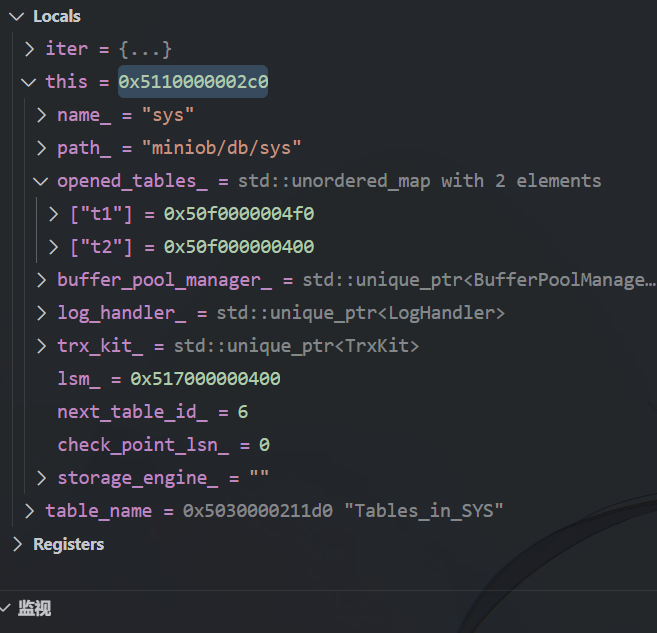

# Miniob进阶

[miniob](https://hub.docker.com/r/oceanbase/miniob) 是 OceanBase 与华中科技大学联合开发的、面向零基础数据库内核知识同学的一门数据库实现入门教程实践工具，设计目标是让不熟悉数据库设计和实现的同学能够快速的了解与深入学习数据库内核。

## 资源

- Cursor 导入 Vscode 配置：https://github.com/maomao1996/daily-notes/issues/50
- Miniob提交：https://open.oceanbase.com/train/detail/3?questionId=200001
    - 注意，提测会测试所有题目
- [Using C++ and WSL in VS Code](https://code.visualstudio.com/docs/cpp/config-wsl)
- [Miniob架构文档](https://oceanbase.github.io/miniob/design/miniob-architecture/#_3)

## 初次安装

### Run Miniob on Docker

注意，我的Miniob-Docker是部署在AWS上的，因为国内的Docker没法连到Github。如果能给国内Docker配好代理，或者手动传入项目文件夹，倒也可以正常使用。

```shell
# 1. Docker下载官方miniob镜像
# --privileged: 获取root权限
# -v: 挂载本地目录到容器内(共享目录，修改实时同步)
docker run -d --privileged --name=miniob oceanbase/miniob

# 2. 进入容器内部，编译安装
docker exec -it miniob bash
git clone https://github.com/oceanbase/miniob.git
cd miniob
bash build.sh --make -j4 

# 3. 编译后，进入build目录，运行
cd build
# 以后修改数据库后，执行：
# make clean
# make -j32
./bin/observer -s miniob.sock -f ../etc/observer.ini & # 在后台启动服务
# kill -9 $(pgrep observer) # 关闭服务

# 4. 连接数据库
./bin/obclient -s miniob.sock
```

### Build Miniob from Source

参考https://oceanbase.github.io/miniob/how_to_build/#2。

```shell
git clone https://github.com/oceanbase/miniob/
cd miniob
bash build.sh init # 136.92s user 29.97s system 34% cpu 8:09.70 total
bash build.sh -j32 # 编译，32核WSL2-Ubuntu原生文件夹，需要351s：351.20s user 39.44s system 76% cpu 8:32.50 total
```

## 项目依赖

### stdarg.h

- `stdarg.h`：C标准库，可变参数列表的处理，类似python的`*args`和`**kwargs`。

    *   相关的宏和类型有：
        *   `va_list`: 用于声明一个指向参数列表的变量。
        *   `va_start`: 初始化 `va_list` 变量，使其指向第一个可变参数。
        *   `vsnprintf`: 用于根据格式字符串和参数列表将格式化的输出写入字符数组，并且它是安全的，可以防止缓冲区溢出。
        *   `va_end`: 清理 `va_list` 变量。

一个使用示例：

```c
const int buffer_size = 4096;
char     *str         = new char[buffer_size];

va_list ap;
va_start(ap, fmt);  // fmt格式串由调用者提供，格式检查于外部完成 (?)
vsnprintf(str, buffer_size, fmt, ap);   // 将fmt格式化的字符串写入str中
va_end(ap);
```

## 开发调试(非首次安装)

当前开发流程：

- 本地：Docker已全部删除，直接在WSL下编译。
- 远程(AWS)：有miniob原生容器(main+2024competition)，可以用作对比测试。main和2024competition的代码差异不大，仅相差大概50个commit，实际测试时在`SELECT`和`DROP`上基本也没有差异。

本地使用Cursor/Vscode+GDB调试：先启动Miniob(F5)，再进行连接：

```shell
cd build
./bin/obclient -h 127.0.0.1 -p 6789
```

**注意**：

1. 我的GDB似乎不支持热重载，必须重新编译启动才能应用更改；

2. **每次F5应在同一个活动窗口下**，因为miniob会在与你活动窗口同级的文件夹下创建一个新的`miniob`文件夹(存放`data`,`table`,`log`等)，每次F5的位置都不一样的话，miniob就会在你的项目里到处拉屎，每次新开一个调试进程就会创建一个新数据库。

**测试命令**：

### Drop Table

```sql
-- Drop Table
show tables;
create table test_drop (id int, name char(10));
insert into test_drop values (1, 'test1'), (2, 'test2'), (3, 'test3');
-- Drop Table
drop table test_drop;
show tables;
select * from test_drop;    -- 应输出FAILURE
```

### Select Table

**注意**：**miniob原生不支持insert的逗号分隔符，只能逐行插入。**最开始调试时，我以为是select的内部实现有问题，导致执行`insert into t1 values (1, 'Alice'), (2, 'Bob'), (3, 'Charlie');`之后，`select * from t1;`只能显示`Alice`一行数据。调了半天，也检查了`.l`和`.y`文件，才发现是`insert`语句的解析问题！

发现这一点后重新测试，`select`需要自行实现的只有`table.*`的解析。

```sql
-- Select Table
-- 创建第一张表
create table t1 (id int, name char(10));
-- 插入数据
-- 注意，miniob原生不支持insert的逗号分隔符，只能逐行插入
/* insert into t1 values (1, 'Alice'), (2, 'Bob'), (3, 'Charlie'); */
insert into t1 values (1, 'Alice');
insert into t1 values (2, 'Bob');
insert into t1 values (3, 'Charlie');

-- 创建第二张表
create table t2 (id int, score int);
/* insert into t2 values (1, 90), (2, 85), (4, 95); */
insert into t2 values (1, 90);
insert into t2 values (2, 85);
insert into t2 values (4, 95);
```

**测试**：

```sql
-- 多表查询测试

-- 全表笛卡尔积
select * from t1, t2;
-- 结果应该有9行(3×3)，每行包含t1和t2的所有列

-- 指定表的所有列，未通过(不支持.*语法)
select t1.*, t2.* from t1, t2;
-- 结果应与上一查询相同
-- 实际：Failed to parse sql

-- 指定具体列
select t1.id, t1.name, t2.score from t1, t2;

-- 带条件的多表查询
select t1.id, t1.name, t2.score from t1, t2 where t1.id = t2.id;
-- 只返回id匹配的行(相当于内连接)

-- 不等条件查询(使用!=)
select t1.id, t1.name, t2.id, t2.score from t1, t2 where t1.id != t2.id;

-- 不等条件查询(使用<>)，与上面相同
select t1.id, t1.name, t2.id, t2.score from t1, t2 where t1.id <> t2.id;

-- 复杂条件查询
select t1.id, t2.score from t1, t2 where t1.id < t2.id and t2.score > 90;
```

## 功能分析

数据库启动后，会在`one_thread_per_connection_thread_handler.cpp`的81行进行无限循环，等待用户输入sql命令。

### Drop Table

- 实现删除表(drop table)，清除表相关的资源。
- 当前MiniOB支持建表与创建索引，但是没有删除表的功能。
- 在实现此功能时，除了要删除所有与表关联的数据，不仅包括磁盘中的文件，还包括内存中的索引等数据。
- 删除表的语句为 `drop table table-name`

#### 执行流程

1. `net/one_thread_per_connection_thread_handler.cpp`：进入`net/sql_task_handler.cpp`的`handle_event`函数；
2. `handle_event`函数：调用`net/plain_communicator.cpp`的`read_event`函数，通过网络通信解析并设置原始SQL语句；然后，调用`observer/session/session_stage.cpp`的`handle_request2`函数，设置当前session；
3. 继续在`sql_task_handler.cpp`里执行，执行到`rc = handle_sql`，调用本文件内的`handle_sql`函数；`handle_sql`分多步执行`handle_request`：缓存检查、解析、语义解析、执行、返回结果；
    1. `query_cache_stage`：调用`query_cache_stage.cpp`的`handle_request`函数，该函数直接返回`RC::SUCCESS`，推测是“检查是否有缓存的查询结果”(标了一个FIX)；
    2. `parse_stage_`：调用`observer/sql/parser/parse_stage.cpp`的`handle_request`函数，进行：
        1. SQL词法分析：将`drop table test`解析为`DROP`、`TABLE`、`test`三个token；
        2. SQL语法解析：构建抽象语法树AST
        3. 识别为 `DROP TABLE` 操作，创建并设置sql node：`DropTableSqlNode`，包含表名`test`；
        4. 返回`RC::SUCCESS`；
    3. `resolve_stage_`：调用`observer/sql/resolve_stage.cpp`的`handle_request`函数，进行SQL语义解析，`resolve_stage.cpp`需要调用`observer/sql/stmt/stmt.cpp`的`create_stmt`函数；
        1. `create_stmt`函数：命中`SCF_DROP_TABLE`case，调用我新建的`observer/sql/stmt/drop_table_stmt.cpp`的`create`函数；
    4. `optimize_stage_`：调用`observer/sql/optimizer/optimize_stage.cpp`的`handle_request`函数，该函数内调用`create_logical_plan`函数，创建逻辑计划；
        1. `create_logical_plan`函数，调用`LogicalPlanGenerator`类的`create`方法，`DROP TABLE`会命中`StmtType::DROP_TABLE` case，创建一个`DropTablePlan`对象；
            1. 可能返回`RC::SUCCESS`，也可能返回`RC::UNIMPLEMENT`，表示当前操作不支持/未实现，但`sql_task_handler.cpp`进行检查时，会认为`rc != RC::UNIMPLEMENTED && rc != RC::SUCCESS`时都算成功；
            2. `DROP TABLE`不算复杂操作，如果为了架构一致性和可扩展性，可以创建具体的逻辑计划。这次作业实现我选择直接在`LogicalPlanGenerator.create`里返回`RC::UNIMPLEMENTED`，然后交给`execute_stage_`处理。
        3. `DROP TABLE`在`create_logical_plan`后即返回，后续的`optimize`、`generate_physical_plan`等优化不再执行(但`SELECT`等复杂查询会执行)。
        
    5. `execute_stage_`：调用`observer/sql/executor/execute_stage.cpp`的`handle_request`函数，进行SQL执行；
        1. `handle_request`：SQL命令可能有两种处理方式：
            1. 物理算子：通常是针对 `SELECT、JOIN` 等需要优化的复杂查询操作，包含了执行查询的详细步骤（如表扫描、索引扫描、连接算法等），其路径应用了查询优化器的**优化结果**
                1. 物理算子会生成**执行计划**，走`ExecuteStage`类的`handle_request_with_physical_operator`函数；
            2. 逻辑算子：通常是针对 `CREATE、INSERT、UPDATE、DELETE` 等非DQL语句，走`CommandExecutor`类的`execuate`函数直接执行即可。
        2. `DROP TABLE`命令属于逻辑算子，走我新建的case`StmtType::DROP_TABLE`，调用新建的`observer/sql/executor/drop_table_executor.cpp`的`DropTableExecutor`类的`execute`函数，执行具体的删除表操作。参考：`src/observer/sql/executor/drop_table_executor.cpp`实现
        
4. 执行完以上5步后，返回`handle_event`函数，调用`net/plain_communicator.cpp`的`write_result`写入结果，并检查是否需要关闭连接，需要则返回`RC::INTERNAL`，否则返回`RC::SUCCESS`；
5. `handle_event`函数返回，重新进入`one_thread_per_connection_thread_handler.cpp`的循环，等待下次输入。

### Select Table

当前系统支持单表查询的功能，需要在此基础上支持多张表的笛卡尔积关联查询。

**仅支持**：`select * from t1;`

**需要实现**：

`select * from t1,t2; `

`select t1.,t2. from t1,t2;`

`select t1.id,t2.id from t1,t2;`

查询可能会带条件。查询结果展示格式参考单表查询。注意查询条件中的“不等”比较，除了"<>"还要考虑"!=" 比较符号。

#### 执行流程

流程基本与`drop table`相同，主要区别在于`resolve_stage_`和`optimize_stage_`的处理：

1. `resolve_stage_`：
    1. `observer/sql/stmt/select_stmt.cpp`的`create`静态方法：将解析树节点(SelectSqlNode)转换为语句对象(SelectStmt)。`SELECT`的语法比`DROP`复杂很多，所以处理流程也更复杂。

    `SelectStmt`类负责：

    - 组织FROM子句中的表
    - 收集SELECT子句中的字段表达式
        - 调用`observer/sql/parser/expression_binder.cpp`的`bind_expression`方法，
    - 处理GROUP BY子句的分组表达式(暂未考虑，因为题目没要求)
    - 管理WHERE子句的过滤条件
        - 调用`observer/sql/stmt/filter_stmt.cpp`的`create`方法
        - `create`方法先创建一个`FilterStmt`对象，再调用同一文件的`create_filter_unit`
        - `create_filter_unit`判断`WHERE`子句的`comp`是否在`parse_defs.h`的`CompType`枚举类中；若是，则继续判断`comp`两侧是否为`attr`；若是，则需要调用`get_table_and_field`(获取表名和字段名)，否则(为立即数)不需要
    - 构建最终的`SelectStmt`对象

2. `optimize_stage_`：调用`observer/sql/optimizer/optimize_stage.cpp`的`handle_request`函数；当前官方main分支的代码在此函数中有许多TODO，包括`unify the RBO and CBO`、`better way to generate general child`、`error handle`等。
    1. 该函数先利用`LogicalPlanGenerator::create`创建逻辑计划，`create`命中case`StmtType::SELECT`，调用`LogicalPlanGenerator::create_plan`模板中的`select`；
    2. 创建完逻辑计划后，`handle_request`会继续调用`rewrite`(对逻辑操作符树进行重写优化)等
    3. 接着，调用`generate_physical_plan`生成物理计划。

3. `execute_stage_`：与`DROP TABLE`不同，`SELECT`命令属于物理算子，走`ExecuteStage`类的`handle_request_with_physical_operator`函数。该函数会创建一个`PhysicalOperator`对象，负责执行查询操作。

#### 功能实现

我开始使用的`commit 309fec7`基本已经实现了`SELECT`的功能，只差一个`select t1.*, t2.* from t1, t2;`的解析，需要修改`yacc_sql.y`语法解析文件。该文件大概565行左右有一处注释`your code here`，在下面添加：

```cpp
    // your code here
    | ID DOT '*' { // 处理 SELECT table.*
    // $1 是 ID (表名), $3 是 '*'
    // StarExpr 构造函数可以接受表名
    $$ = new StarExpr($1); // $1 是 cstring (char*)，StarExpr 构造函数可能需要 const char*
    // $$->set_name(std::string($1) + ".*"); // 可选：设置一个描述性的名称
    // yylval->cstring 在 .l 文件中是通过 strdup 分配的，这里 $1 被 StarExpr 内部复制或使用后，
    // 如果 StarExpr 不接管 $1 的内存，需要考虑是否要释放 $1。
    // 但由于 yacc 会自动管理 %union 中 cstring 的内存（通过yyextra机制），通常不需要手动释放。
    // 确认 StarExpr 如何处理传入的表名（是复制还是仅保存指针）：
    // 根据 `expression.h`，StarExpr 类内部使用 `private: std::string table_name_`，所以构造函数 
    // StarExpr(const char *table_name) : table_name_(table_name) 会进行复制，是内存安全的。
    }
```

即可。

#### `select * from Tables_in_SYS`返回`FAILURE`的原因

当前`select * from Tables_in_SYS;`会返回`FAILURE`，调试发现在`handle_sql`函数中的`resolve_stage_`返回`RC::SCHEMA_TABLE_NOT_EXIST`；继续追溯，发现在`select_stmt.cpp`的`create`函数中，处理`FROM`子句时调用的`observer/storage/db/db.cpp:Table *Db::find_table(const char *table_name) const`返回了nullptr，即没有找到`Tables_in_SYS`表。

该函数具体实现：

```cpp
Table *Db::find_table(const char *table_name) const
{
  unordered_map<string, Table *>::const_iterator iter = opened_tables_.find(table_name);
  if (iter != opened_tables_.end()) {
    return iter->second;
  }
  return nullptr;
}
```

哈希查找区分大小写，找不到可能是表不存在、表名大小写有误或者有前后缀/空格等问题，但最有可能的应该是`Tables_in_SYS`表没有加载到`opened_tables_`集合(因为系统表一般不应对外开放)。经内存检查发现确实如此：

## 杂项问题

### Database duration

每次重启调试后，会丢失所有table里的数据，但表结构不会丢失。这是Miniob的“特性”吗？以后开发可能要注意一下五个阶段结束后的数据清理环节。

### Fork Merge

我一周前clone的原生仓库，今天我先fork并连接到自己的分支，再在本地原生仓库修改，现在原仓库可能有一些改动，包含在了我的fork里。因此，直接`git pull`会失败。

**解决**：

```shell
# 0. 设置pull策略为rebase，保持提交记录的整洁
git config pull.rebase true
# 1. 添加你的远程仓库
git remote add origin https://github.com/Chesszyh/miniob.git
# 2. 从上游仓库拉取最新代码并变基
git pull upstream main --rebase
```

输出：有一处文件冲突，一个新增文件夹冲突，其他文件都auto-merged。

```shell
From https://github.com/oceanbase/miniob
 * branch            main       -> FETCH_HEAD
warning: unable to rmdir 'docs/lectures-on-dbms-implementation': Directory not empty
Auto-merging src/common/sys/rc.h
CONFLICT (content): Merge conflict in src/common/sys/rc.h
Auto-merging src/observer/sql/parser/parse_defs.h
Auto-merging src/observer/storage/db/db.cpp
Auto-merging src/observer/storage/db/db.h
Auto-merging src/observer/storage/default/default_handler.cpp
Auto-merging src/observer/storage/table/table.cpp
Auto-merging src/observer/storage/table/table.h
error: could not apply 673c550... add 'drop table` feature
hint: Resolve all conflicts manually, mark them as resolved with
hint: "git add/rm <conflicted_files>", then run "git rebase --continue".
hint: You can instead skip this commit: run "git rebase --skip".
hint: To abort and get back to the state before "git rebase", run "git rebase --abort".
Could not apply 673c550... add 'drop table` feature
```

解决`rc.h`文件冲突，然后：

```shell
# 3. 推送到你的远程仓库
git add .
git rebase --continue
git push origin main
```

这样操作可以：

- 保持提交历史整洁
- 确保代码基于最新的上游代码
- 避免产生不必要的合并提交

如果之后想避免这个问题，建议：

- 经常从上游仓库同步代码
- 在开发新功能时创建新的分支
- 完成功能后再合并到主分支

### 相同依赖、不同版本代码的编译

**结论**：**相同依赖、不同版本代码的编译，如果脚本是将依赖安装到系统路径，则不需要重复执行`init`，否则若前后版本依赖出现变动，新项目的`init`可能会导致原项目编译失败。**

因此，要么将依赖安装到项目目录下，要么在系统路径下做好版本管理，比如`/opt/miniob_deps/libevent/2.1.12/`(但这样CMake的配置会更加麻烦)。

---

项目根目录下`build.sh`脚本主要负责两件事：初始化依赖环境和编译 MiniOB 项目本身。

**脚本主要功能细分：**

1.  **`init` (初始化依赖):**
    *   执行 `git submodule update --init` 来获取或更新项目所依赖的第三方库（子模块），例如 libevent、googletest、google benchmark 和 jsoncpp。
    *   对于每一个第三方依赖库：
        *   进入该库的源代码目录。
        *   创建一个 `build` 子目录。
        *   运行 CMake (`${CMAKE_COMMAND}`) 来配置该库的编译选项。在这个 CMake 配置阶段，你会看到类似 `-- Performing Test check_c_compiler_flag__Wall` 的输出。
            * **注意**：**这些是 CMake 在配置构建环境时进行的检查，而不是在运行项目的单元测试。**对于依赖库，脚本已经通过传递`-DBENCHMARK_ENABLE_TESTING=OFF` 和 `-DJSONCPP_WITH_TESTS=OFF`等参数来禁止编译它们各自的测试套件。
        *   运行 `make` 来编译该库。
        *   运行 `make install` 将编译好的库文件和头文件安装到系统（通常是像 lib、include 这样的标准路径，具体取决于各个库的 CMake 配置）。

2.  **`clean` (清理):**
    *   删除项目根目录下所有名为 `build_debug` 或 `build_release` 的构建目录。

3.  **构建 MiniOB 项目 (例如执行 `.build.sh debug` 或 `.build.sh release`):**
    *   `prepare_build_dir`: 根据指定的构建类型（默认为 `debug`），创建相应的构建目录（如 `build_debug`），并在项目根目录创建一个名为 `build` 的软链接指向这个实际的构建目录。
    *   `do_build`: 在上一步创建的构建目录中运行 CMake，用以配置 MiniOB 主项目的编译选项。
    *   `try_make`: 如果你在命令中指定了 `--make`，则会接着在构建目录中执行 `make` 命令来编译 MiniOB 项目。
    *   通常，`release`的编译速度会比`debug`快，因为`debug`模式会包含更多的调试信息和检查。